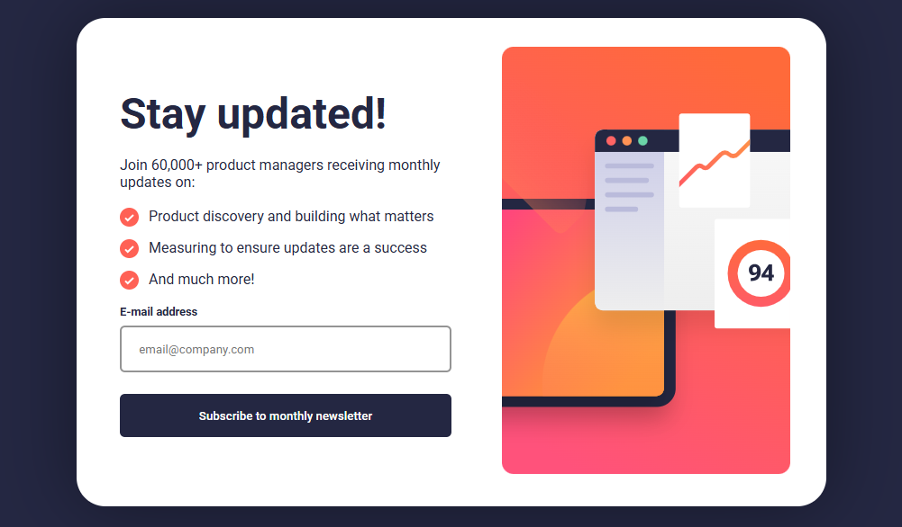

# newsletter-sign-up-with-success-message-main
## 🚀 Descrição do Projeto
Este projeto é uma landing page de um formulário de newsletter com uma mensagem de sucesso, desenvolvido para praticar conceitos de HTML, CSS e JavaScript. Ele apresenta um layout responsivo que se adapta a telas de dispositivos móveis e desktops, incluindo validação de e-mail e uma transição suave entre o formulário e a tela de sucesso.

---

## 🎨 Preview


---

## 💻 Tecnologias Utilizadas

- HTML5: Para a estrutura e marcação da página.

- CSS3: Para estilização, layout flexível (Flexbox) e responsividade usando Media Queries.

- JavaScript (ES6): Para validação do formulário, manipulação do DOM e controle da exibição das seções.

---

## 🎯 Desafios e Aprendizados

- Responsividade: O projeto foi desenhado com a abordagem "Mobile First", onde os estilos básicos são definidos para telas menores e depois ajustados para telas maiores usando media queries.
- Manipulação de Classes: O uso de classList.toggle() no JavaScript foi fundamental para exibir ou esconder as seções da página de forma dinâmica, gerenciando as classes desaparece e input-error.
- Layout Flexbox: O uso de display: flex foi essencial para organizar o layout principal (main) e outros elementos, tanto na versão mobile quanto na desktop.
- Validação de E-mail: Implementação de uma expressão regular (regex) no JavaScript para validar o formato do e-mail inserido pelo usuário.

---

## 📁 Estrutura de Arquivos

```
/
├── src/
│   ├── css/
│   │   ├── media.css
│   │   └── style.css
│   ├── images/
│   │   ├── favicon-32x32.png
│   │   ├── icon-list.svg
│   │   ├── icon-success.svg
│   │   ├── illustration-sign-up-desktop.svg
│   │   ├── illustration-sign-up-mobile.svg
│   │   ├── illustration-sign-up-tablet.svg
│   │   └── preview.png
│   └── scripts/
│       └── script.js
├── .gitignore
├── index.html
├── LICENSE
└── README.md
```

---

## 🌐 Como Acessar o Projeto

Você pode visualizar a demonstração do projeto online através do GitHub Pages:

- URL: https://charlesson-mp.github.io/newsletter-sign-up-with-success-message-main

O código-fonte completo está disponível no repositório do GitHub:

- Repositório: https://github.com/Charlesson-MP/newsletter-sign-up-with-success-message-main